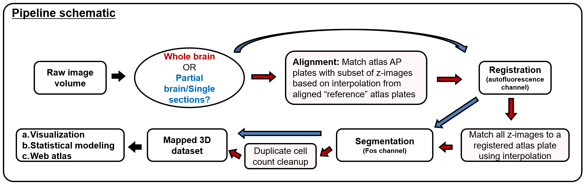

# SMART (Semi-Manual Alignment to Reference Templates)

**Pre-print: [SMART: An open source extension of WholeBrain for iDISCO+ LSFM intact mouse brain registration and segmentation](https://www.biorxiv.org/content/10.1101/727529v1)**

## Mar-30-2021: SMART version 1.1 release

talk about it here

### New Features
- something
- something

## What is SMART?

Mapping immediate early gene (IEG) expression across intact brains is becoming a popular approach for identifying the brain-wide activity patterns underlying behavior. Registering whole brains to an anatomical atlas presents a technical challenge that has predominantly been tackled using automated voxel-based registration methods; however, these methods may fail when brains are damaged or only partially imaged, can be challenging to correct, and require substantial computational power. Here we present an open source package in R called SMART (semi-manual alignment to reference templates) as an extension to the WholeBrain framework for automated segmentation and semi-automated registration of experimental images to vectorized atlas plates from the Allen Brain Institute Mouse Common Coordinate Framework (CCF).

The SMART package was created with the novice programmer in mind and introduces a streamlined pipeline for aligning, registering, and segmenting large LSFM volumetric datasets with the CCF across the anterior-posterior axis, using a simple ‘choice game’ and interactive user-friendly menus. SMART further provides the flexibility to register partial brains or discrete user-chosen experimental images across the CCF, making it compatible with analysis of traditionally sectioned coronal brain slices. 

## Pipeline 👷

## Installation ⚙️

- [Install SMART](docs/installation.md)

## Tutorial 📚
- [Introduction](docs/index.md) 🔨
- [Full Tutorial](docs/tutorial.md) 🏭

## Resources 💾

### Wholebrain webpage
- [Wholebrain by Daniel Furth](https:/http://www.wholebrainsoftware.org/) 🐭

### Open brain map
- [Interactive open brain map](https://http://www.openbrainmap.org/#2/7345/5135) 🗺️

### SMART example data and references
- [Access sample data here](docs/example_data.html) 📘

### Golden Lab webpage
- [Sam Golden Lab UW](https://goldenneurolab.com/) 🧪🧫🐁

## License 📃
[insert license info?]

## Contributors 🤼
- [Michelle Jin](https://github.com/mjin1812)
- [Joseph Nguyen](https://github.com/jdknguyen)
