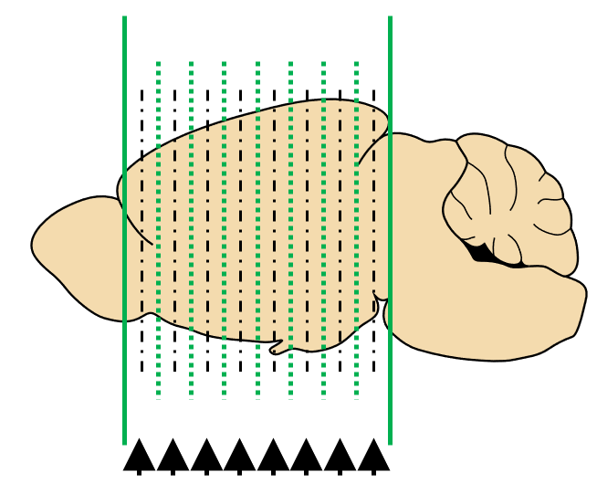

# Tutorial

## Pipeline breakdown:

For processing a wholebrain dataset, the pipeline is split into 6 sections. These sections are listed below along with the functions that belong to each section:

**Part 1: Setup pipeline**

  - `setup_pl()` User friendly way to setup parameters for whole
    or partial brain pipeline analysis.
  - `im_sort()` A function to sort image paths for imaging
    datasets.
  - `get_savepaths()` Generate savepaths and save directories.

**Part 2: Alignment (W)**

  - `choice()` **(W)** User friendly choice game to align
    internal reference atlas plates.
  - `brainmorph()` **(W)** Generate a brain morph plot.
  - `interpolate()` **(W)** Interpolate all AP and z numbers for
    atlas plates in a whole brain project

**Part 3: Registration**

  - `registration2()` Console user interface built on top of
    registration() function from the wholebrain package.
  - `regi_loop()` Automatically loops through the image
    registration process for the imaging dataset.

**Part 4: Segmentation, duplicate cleanup, & forward warping**

  - `filter_loop()` Loops through reference slices and allows
    user to check/change filter settings for segmentation or
    registration.
  - `seg_loop()` Loop through and segments images in the
    segmentation channel.
  - `clean_duplicates()` **(W)** Duplicate cell count clean up
    of segmentation output.
  - `cell_counter()` Determines total number of cells
    segmented, retained, and removed by duplicate cleanup.
  - `forward_warp()` Performs forward warp loop back onto atlas
    space using segmentation and registration output.

**Part 5. Dataset manipulation and plotting**

  - `isolated_dataset()` Isolates a user-specified subset of
    the forward warped dataset.
  - `get_rois()` Gets a subset of the forward warped dataframe
    of just regions of interest.
  - `get_sunburst()` Generates a sunburst plot using a forward
    warped dataset.
  - `get_tree()` Creates a dataframe of hierarchical region
    cell count data.
  - `glassbrain2()` Generates a 3D plot of cells counts with
    option of removing glassbrain in the background.
  - `get_table()` Generates a dataframe showing region
    acronyms, their full name, hierachical paths, total cell counts,
    left and right counts, and cell count percentages.

**Part 6. Aggregating data from multiple analyses**

  - `concatenate()` Combines datasets from multiple brains.
  - `cell_count_compilation()` Compiles cell counts from
    multiple brains.
  - `get_groups()` Compiles group data from individual brains.
  - `voxelize()` Generate voxel-based heatmaps from multiple
    brains.
  - `voxel_stats()` Run statistical tests on voxel-based
    heatmaps.

Below is a walkthrough of each of these functions and the pipeline as a whole using an example whole brain dataset.

## Part 1: Setup pipeline ##

This sections sets up analysis parameters, sorted image paths, and generates savepaths and directories for the rest of the pipeline.

**Step 1.**

`setup_pl()` This function asks the user for setup information. Based on input from the user, the function returns a list of parameters for either a whole or partial brain analysis.

```diff
# Scroll to the details section of the help page to see the setup parameters
?setup_pl()

# Run setup_pl, enter parameter information to the console, 
# and store the output list into a variable named setup

setup <- setup_pl()

# Check or modify your setup parameters 
setup <- setup_pl(setup)

# Note: Whenever a different user works on analyzing the same dataset,
# run the above command to change user initials. This will keep track of
# who did what. 
```

### Tips: When providing folder paths, do not put quotes around the path to the console input.

For convention, sequential image numbers are z image numbers, even for a partial brain analysis. Z image number should start at 1 and end at the number of images. Image files should start indexing at 1 in the filenames to match image number.

For a whole brain analysis, the first and last atlas plates must be qualitatively aligned with the first and last z image numbers. Note that the `setup$internal_ref_z`, `setup$regi_AP`, `setup$regi_z` parameters are not user modifiable and will be NULL until the `choice()` or `interpolate()` functions are run.

Additionally, there are a few default pipeline parameters for whole brain analysis:
- Spacing between registrations (mm). DEFAULT: 0.100
- Segmentation step (integer). DEFAULT: 1.
- AP coordinates of internal reference planes. DEFAULT: 1.91, 1.10, -.42, -0.93 , -1.94 , -2.95, -3.96.

The above coordinates correspond to PFC, NAc, antHyp, start of HIP, posterior Hyp, VTA, and the PAG, respectively. These coordinates will be the atlas plates used to “calibrate” to internal z images. They’ll be used to interpolate and match the z images of remaining atlas plates. They were chosen because:

1) Based on our experience, they contain easy internal region landmarks that can be consistently identified by different users
2) They are somewhat evenly spaced throughout the brain.

However, these coordinates are user modifiable to account for user preference and varying AP ranges of imaging datasets. If you are using this pipeline for the first time, I recommend you take the default values.

The console code below shows the setup list I am using:

```diff
# Check setup list

> setup <- setup_pl(setup)

Your animal ID         :  1602
Your initials          :  MJ
Your registration path :  D:/output_R15_1602_SG_Rein_NoTest_coronal/R15_1602_SG_Rein_NoTest_coronal_final_C02_betterrotation
Your segmentation path :  D:/output_R15_1602_SG_Rein_NoTest_coronal/R15_1602_SG_Rein_NoTest_coronal_final_C01_betterrotation
Your output path       :  D:/SMART_example_data/output
Your z spacing         :  0.0025
Your registration step :  0.1
Your segmentation step :  1
Your first AP          :  2.82
Your first z           :  200
Your last AP           :  -4.77
Your last z            :  2925
Your internal reference AP coordinates:  1.91 1.1 -0.42 -0.93 -1.94 -2.44 -2.95 -3.45 -3.96
Please review your setup information above:
Do you want to change any settings: Y/N?

```

**Step 2.**

`im_sort()` User friendly way to sort images from the registration channel. Asks for user input to account for flexible naming conventions for images.

```diff
# Sort images and store them 

# There will be user walk through for the 'separator' 
# and 'position' information necessary to sort images 
setup <- im_sort(setup, extension = "tif")

# Note: Setting the position argument will skip the user walkthrough. 
# e.g.
setup <- im_sort(setup, extension = "tif", position = 9)

# Check image_paths
setup$image_paths
```

**Step 3.**

`get_savepaths()` Create standardized save directories based on the setup information from `setup_pl()`. setup is returned with setup$savepaths filled containing savepaths to subfolders in the output folder.

```diff
# Create savepaths and generate data subdirectories automatically 
setup <- get_savepaths(setup)

# Check the output folder to see the subdirectories created!

# Show savepaths generated
setup$savepaths

# To save the global environment at any time during an analysis session run: 
save.image(setup$savepaths$envir_savepath)

# Going to the R_data folder in the output folder and clicking on the 
# .RData folder by date will revert the global environment back to a previous session.
# Saving everyday will prevent you from losing more than a day's worth of work.
```

### Tip: rerun the save.image() expression to update the global environment savepath every day.

Below shows my console output for my savepaths variable:

```diff
# Update and show savepaths

> setup <- get_savepaths(setup)
> setup$savepaths
$`envir_savepath`
[1] "D:/SMART_example_data/output/R_data/Animal_1602_2019-01-20_MJ.RData"

$out_reference_aligned
[1] "D:/SMART_example_data/output/Reference_aligned"

$out_RC_brain_morph
[1] "D:/SMART_example_data/output/RC_brain_morph"

$out_auto_registration
[1] "D:/SMART_example_data/output/Registrations_auto"

$out_registration
[1] "D:/SMART_example_data/output/Registrations_manual"

$out_registration_warps
[1] "D:/SMART_example_data/output/Registration_warps"

$out_segmentation_warps
[1] "D:/SMART_example_data/output/Segmentation_warpimages"

$out_segmentation_schem
[1] "D:/SMART_example_data/output/Segmentation_schematics"
```

## Part 2: Alignment (W)

This section is necessary for whole brain datasets only. Users first “calibrate” the reference atlas plates with their appropriate z image number by running `choice()` and playing the choice game. Based on the aligned reference plates, the user can match all remaining atlas plates with an interpolated z image using `interpolate()`.

**Step 4.**

`choice()` **W** User friendly way to play the wholebrain choice game to align internal reference atlas plates. Automatically saves images of chosen aligned images in the folder specified by `setup$savepaths$out_reference_aligned`.

Below is my initial console output when I run `choice()` with my setup variable.

```diff
# Run the choice game and save the aligned 
# z reference number back into the setup list:

> setup <- choice(setup, filetype = "tif") # save chosen images as tifs
Play the choice game!
Your reference AP is 1.91 
Your current image sampling choice_step is  200 

Which image matches best?
Enter 1, 2 or 3:
```

**How the choice game works:**

The choice game will cycle through the internal reference atlas plates (represented below by dotted vertical lines). Three choice windows will popup for each reference AP coordinate, corresponding to choices 1,2 or 3, respectively. The user simply compares the corresponding atlas plate with the 3 choice windows and enters the best qualitative match.

<p align="center">

<!-- {width=30%} -->
</p>

<center>

<!-- {width=30%} -->

``` r
run_path("schematics/Reference_atlas_schem.PNG")
```


</center>


